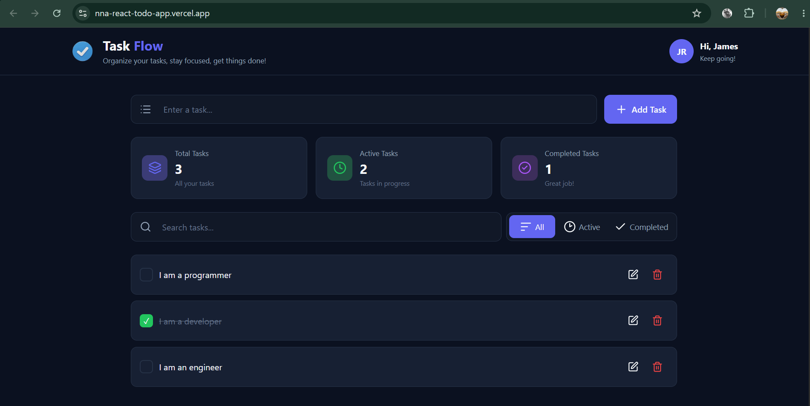

# React Todo App

A responsive Todo application built with React for managing daily tasks with a clean and intuitive user interface.

## Live Demo

[View Live Demo](https://nna-react-todo-app.vercel.app)

## Screenshot



## Features

- Add new tasks
- Mark tasks as completed
- Edit existing tasks
- Delete tasks
- Search tasks
- Filter tasks by status
- Task statistics
- Form validation
- Responsive design

## Tech Stack

- React
- JavaScript
- CSS
- Vite
- Lucide React

## Project Structure

```text
src/
├── components/
│   ├── Header.jsx
│   ├── TodoInput.jsx
│   ├── TodoItem.jsx
│   ├── TodoList.jsx
│   ├── TodoSearch.jsx
│   ├── TodoStatistics.jsx
│   └── TodoEdit.jsx
│
├── App.jsx
├── App.css
├── index.css
└── main.jsx
```

## Getting Started

### 1. Clone the repository

```bash
git clone https://github.com/jamesroben29-coder/react-todo-app.git
```

### 2. Navigate to the project folder

```bash
cd react-todo-app
```

### 3. Install dependencies

```bash
npm install
```

### 4. Start the development server

```bash
npm run dev
```

The application will be available at the local development URL shown in your terminal.

## Build for Production

```bash
npm run build
```

## Lint

```bash
npm run lint
```

## What I Practiced

This project helped me practice:

- React components and props
- React state management with `useState`
- Event handling
- Form handling and validation
- Array methods such as `map()` and `filter()`
- Conditional rendering
- Search and filtering logic
- Component-based UI development
- Responsive CSS
- Git and GitHub workflow
- Deployment with Vercel

## Author

**James Roben**

Frontend Developer in training